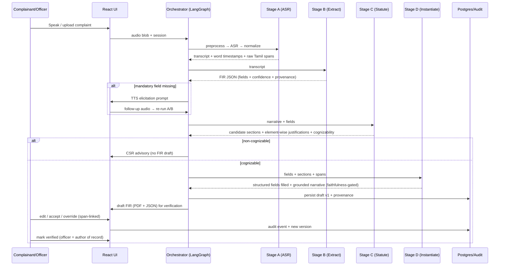
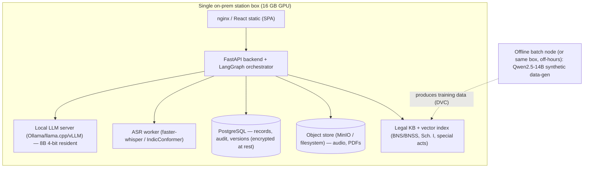

# ARCHITECTURE.md — Speech-Driven FIR Drafting System (Tamil Nadu IF-1)

## 1. Component diagram

```mermaid
flowchart LR
    subgraph Client["Client (React SPA)"]
        MIC["Mic / file upload"]
        UI["Officer review workspace"]
    end

    subgraph API["Backend (FastAPI + LangGraph orchestrator)"]
        GW["API gateway / auth (RBAC)"]
        ORCH["LangGraph pipeline orchestrator"]
    end

    subgraph StageA["Stage A — Speech & ASR"]
        AUD["Audio pre-proc: 16kHz mono, VAD, diarization"]
        ASR["ASR engine (faster-whisper / IndicConformer)"]
        NORM["Normalizer: punct, ITN, disfluency"]
        TTS["Indic-TTS (guided-interview prompts)"]
    end

    subgraph StageB["Stage B — Extraction (NLU)"]
        NER["A: encoder NER + rule slot-fill"]
        LLMX["B: LLM structured extraction (schema-constrained)"]
        BIL["Bilingual reconciler (ta verbatim / en render)"]
    end

    subgraph StageC["Stage C — Statute engine"]
        CLS["Multi-label offence classifier"]
        RET["RAG retriever (BGE-m3 over BNS/BNSS)"]
        VER["Element-wise verifier (LLM)"]
        MAP["IPC→BNS mapping layer"]
        COG["Cognizability gate (BNSS Sch. I)"]
    end

    subgraph StageD["Stage D — FIR instantiation"]
        TMPL["Deterministic template engine (structured fields)"]
        GEN["Grounded narrative composer (LLM, constrained)"]
        FAITH["Faithfulness / entailment gate"]
        PDF["Bilingual PDF + JSON exporter"]
    end

    subgraph Infra["Shared infra"]
        LLMSRV["Local LLM server (8B 4-bit resident)"]
        KB["Legal KB: BNS/BNSS + special acts + Sch. I"]
        DB[("PostgreSQL: records, audit, versions")]
        BLOB[("Object store: audio, PDFs")]
    end

    MIC --> GW --> ORCH
    ORCH --> AUD --> ASR --> NORM
    NORM --> NER
    NORM --> LLMX
    NER --> BIL
    LLMX --> BIL
    BIL --> CLS --> RET --> VER
    MAP --> CLS
    VER --> COG
    KB --> RET
    KB --> COG
    COG --> TMPL --> GEN --> FAITH --> PDF
    BIL --> TMPL
    PDF --> UI
    COG -. "non-cognizable" .-> UI
    NORM -. "missing mandatory field" .-> TTS -.-> AUD

    LLMX --- LLMSRV
    VER --- LLMSRV
    GEN --- LLMSRV
    ORCH --> DB
    AUD --> BLOB
    PDF --> BLOB
    UI --> GW
```



## 2. End-to-end data flow



## 3. Module boundaries & interface contracts

Contracts are stage-to-stage; each is a versioned Pydantic model over the canonical schema (§5).
Modules communicate through the orchestrator; no module reaches into another's internals.

```python
# ---- Stage A: ASR ----
class ASRResult(BaseModel):
    transcript: str                      # normalized text
    raw_transcript: str                  # pre-normalization, Tamil verbatim
    tokens: list[Token]                  # text, char_start, char_end, audio_start_ms, audio_end_ms, conf
    language_spans: list[LangSpan]       # ta / en / code-switch regions
    diarization: list[SpeakerTurn] | None

def transcribe(audio: AudioRef, cfg: ASRConfig) -> ASRResult: ...

# ---- Stage B: Extraction ----
class ExtractionResult(BaseModel):
    fir: FIRRecord                       # partial, schema-valid; each field carries Provenance+confidence
    approach: Literal["encoder_ner", "llm_structured"]
    missing_mandatory: list[str]         # JSON-pointer paths still empty

def extract(asr: ASRResult, schema_version: str, cfg: ExtractConfig) -> ExtractionResult: ...

# ---- Stage C: Statute engine ----
class StatuteAssessment(BaseModel):
    candidates: list[SectionCandidate]   # act, section, score, elements[], justification, supporting_spans[]
    cognizability: CognizabilityDecision # decision, route(FIR|CSR_advisory), rationale, schedule_ref
    mapping_notes: list[MappingNote]     # IPC→BNS ambiguity flags

def assess_statutes(fir: FIRRecord, narrative: str, kb: LegalKB) -> StatuteAssessment: ...

# ---- Stage D: Instantiation ----
class FIRDocument(BaseModel):
    fir: FIRRecord                       # structured fields (deterministically filled)
    narrative_ta: str
    narrative_en: str
    grounding: list[SentenceGrounding]   # sentence_id, supported, supporting_spans[]
    pdf_ref: BlobRef
    json_ref: BlobRef

def instantiate(fir: FIRRecord, statutes: StatuteAssessment,
                asr: ASRResult, cfg: RenderConfig) -> FIRDocument: ...

# ---- Cross-cutting: audit ----
def record_event(record_id: str, actor: Actor, action: AuditAction,
                 before: dict | None, after: dict | None) -> AuditEvent: ...
```

### REST surface (FastAPI, illustrative)

| Method + path | Purpose |
|---------------|---------|
| `POST /sessions` | Create complaint session |
| `POST /sessions/{id}/audio` | Upload/stream audio → triggers A→B→C→D |
| `GET /sessions/{id}/draft` | Fetch current FIR draft (JSON) + provenance |
| `GET /sessions/{id}/pdf` | Print-faithful bilingual PDF |
| `PATCH /sessions/{id}/fields` | Officer edit/override a field (audited) |
| `POST /sessions/{id}/sections/{sec}/decision` | Accept/override a suggested section |
| `POST /sessions/{id}/verify` | Officer marks verified (author of record) |
| `GET /sessions/{id}/audit` | Immutable audit trail + versions |

## 4. Design invariants

1. **No generative writes to structured fields** — Stage D's template engine is the *only* writer of
   IF-1 structured fields; the LLM only composes the narrative.
2. **Provenance is mandatory** — a field without provenance + confidence is invalid and cannot enter a
   draft (except officer-added fields, tagged `officer_added`).
3. **Faithfulness gate is blocking** — a narrative sentence that fails entailment against its cited
   spans is either dropped or flagged; it never ships silently.
4. **Cognizability routing is explicit** — every record has a routing decision with a Schedule-I
   reference; ambiguity routes to officer, not to a guess.
5. **Everything is versioned & audited** — schema version, KB version, model version, gold version,
   and per-record document versions.

## 5. Canonical FIR JSON Schema (IF-1)

Draft 2020-12. Every extractable field is wrapped so it carries value + bilingual text + confidence +
provenance + edit-status. Structured fields are machine-filled; `narrative` is the only composed text.

```json
{
  "$schema": "https://json-schema.org/draft/2020-12/schema",
  "$id": "https://tn-fir.local/schemas/if1/v1.json",
  "title": "TN FIR (CCTNS IF-1)",
  "type": "object",
  "$defs": {
    "provenance": {
      "type": "object",
      "properties": {
        "utterance_id": { "type": "string" },
        "transcript_char_start": { "type": "integer", "minimum": 0 },
        "transcript_char_end": { "type": "integer", "minimum": 0 },
        "audio_start_ms": { "type": "integer", "minimum": 0 },
        "audio_end_ms": { "type": "integer", "minimum": 0 }
      },
      "required": ["transcript_char_start", "transcript_char_end"]
    },
    "bilingual": {
      "type": "object",
      "properties": {
        "ta": { "type": "string", "description": "Tamil, verbatim where sourced from speech" },
        "en": { "type": "string" }
      }
    },
    "field": {
      "type": "object",
      "description": "Generic extracted field wrapper.",
      "properties": {
        "value": { "type": ["string", "number", "boolean", "null"] },
        "text": { "$ref": "#/$defs/bilingual" },
        "confidence": { "type": ["number", "null"], "minimum": 0, "maximum": 1 },
        "provenance": { "type": "array", "items": { "$ref": "#/$defs/provenance" } },
        "status": { "enum": ["extracted", "elicited", "officer_edited", "officer_added", "empty"] },
        "officer_note": { "type": ["string", "null"] }
      },
      "required": ["value", "status"]
    },
    "person": {
      "type": "object",
      "properties": {
        "name": { "$ref": "#/$defs/field" },
        "relative_type": { "enum": ["father", "husband", "mother", "spouse", "guardian", null] },
        "relative_name": { "$ref": "#/$defs/field" },
        "dob_or_age": { "$ref": "#/$defs/field" },
        "nationality": { "$ref": "#/$defs/field" },
        "occupation": { "$ref": "#/$defs/field" },
        "contact": { "$ref": "#/$defs/field" },
        "address": { "$ref": "#/$defs/field" },
        "passport": {
          "type": "object",
          "properties": {
            "number": { "$ref": "#/$defs/field" },
            "date_place_of_issue": { "$ref": "#/$defs/field" }
          }
        }
      }
    },
    "accused": {
      "type": "object",
      "properties": {
        "known": { "type": "boolean" },
        "unknown": { "type": "boolean" },
        "name": { "$ref": "#/$defs/field" },
        "alias": { "$ref": "#/$defs/field" },
        "relative_name": { "$ref": "#/$defs/field" },
        "physical_description": { "$ref": "#/$defs/field" },
        "address": { "$ref": "#/$defs/field" }
      }
    },
    "property_item": {
      "type": "object",
      "properties": {
        "category": { "$ref": "#/$defs/field" },
        "description": { "$ref": "#/$defs/field" },
        "estimated_value_inr": { "$ref": "#/$defs/field" }
      }
    },
    "section_candidate": {
      "type": "object",
      "properties": {
        "act": { "enum": ["BNS_2023", "BNSS_2023", "MV_Act", "IT_Act_2000", "TN_PHW_Act", "OTHER"] },
        "section": { "type": "string" },
        "description_en": { "type": "string" },
        "score": { "type": "number", "minimum": 0, "maximum": 1 },
        "cognizable": { "type": ["boolean", "null"] },
        "elements": {
          "type": "array",
          "items": {
            "type": "object",
            "properties": {
              "element": { "type": "string" },
              "satisfied": { "enum": ["yes", "no", "unclear"] },
              "justification": { "type": "string" },
              "supporting_provenance": { "type": "array", "items": { "$ref": "#/$defs/provenance" } }
            },
            "required": ["element", "satisfied"]
          }
        },
        "ipc_source": { "type": ["string", "null"], "description": "Original IPC section if mapped" },
        "mapping_ambiguous": { "type": "boolean" }
      },
      "required": ["act", "section", "score"]
    }
  },
  "properties": {
    "schema_version": { "const": "if1/v1" },
    "record_id": { "type": "string" },
    "status": { "enum": ["draft", "under_review", "verified", "csr_advisory"] },
    "created_at": { "type": "string", "format": "date-time" },
    "jurisdiction": {
      "type": "object",
      "properties": {
        "state": { "const": "Tamil Nadu" },
        "district": { "$ref": "#/$defs/field" },
        "police_station": { "$ref": "#/$defs/field" },
        "ps_code": { "type": ["string", "null"] }
      }
    },
    "fir_number": { "type": ["string", "null"] },
    "fir_year": { "type": ["integer", "null"] },
    "fir_date": { "type": ["string", "null"], "format": "date" },
    "acts_sections": { "type": "array", "items": { "$ref": "#/$defs/section_candidate" } },
    "occurrence": {
      "type": "object",
      "properties": {
        "from_datetime": { "$ref": "#/$defs/field" },
        "to_datetime": { "$ref": "#/$defs/field" },
        "is_interval": { "type": "boolean" },
        "info_received_at_ps": { "$ref": "#/$defs/field" },
        "gd_reference": { "$ref": "#/$defs/field" }
      }
    },
    "information_type": { "enum": ["written", "oral", null] },
    "place_of_occurrence": {
      "type": "object",
      "properties": {
        "direction_from_ps": { "$ref": "#/$defs/field" },
        "distance_from_ps_km": { "$ref": "#/$defs/field" },
        "beat_no": { "$ref": "#/$defs/field" },
        "address": { "$ref": "#/$defs/field" },
        "outside_ps_limits": { "type": "boolean" },
        "other_ps_name": { "$ref": "#/$defs/field" },
        "other_district": { "$ref": "#/$defs/field" }
      }
    },
    "complainant": { "$ref": "#/$defs/person" },
    "accused": { "type": "array", "items": { "$ref": "#/$defs/accused" } },
    "delay_reason": { "$ref": "#/$defs/field" },
    "properties_involved": { "type": "array", "items": { "$ref": "#/$defs/property_item" } },
    "total_property_value_inr": { "$ref": "#/$defs/field" },
    "inquest_ud_case_no": { "$ref": "#/$defs/field" },
    "witnesses": { "type": "array", "items": { "$ref": "#/$defs/person" } },
    "narrative": {
      "type": "object",
      "properties": {
        "ta": { "type": "string" },
        "en": { "type": "string" },
        "grounding": {
          "type": "array",
          "items": {
            "type": "object",
            "properties": {
              "sentence_id": { "type": "string" },
              "supported": { "type": "boolean" },
              "supporting_provenance": { "type": "array", "items": { "$ref": "#/$defs/provenance" } }
            },
            "required": ["sentence_id", "supported"]
          }
        }
      }
    },
    "cognizability": {
      "type": "object",
      "properties": {
        "decision": { "enum": ["cognizable", "non_cognizable", "mixed", "undetermined"] },
        "route": { "enum": ["FIR", "CSR_advisory", "officer_review"] },
        "schedule_ref": { "type": "string" },
        "rationale": { "type": "string" }
      },
      "required": ["decision", "route"]
    },
    "audit_ref": { "type": "string", "description": "Pointer to immutable audit log" },
    "document_version": { "type": "integer", "minimum": 1 }
  },
  "required": ["schema_version", "record_id", "status", "jurisdiction", "narrative", "cognizability"]
}
```

## 6. Model-selection matrix (16 GB target; accuracy vs latency vs VRAM)

VRAM figures are inference unless noted; "co-resident" = fits alongside the resident 8B + ASR.

| Stage | Candidate | Params | Precision | VRAM (infer) | Latency (3-min clip / call) | Accuracy notes | Verdict |
|-------|-----------|--------|-----------|--------------|------------------------------|----------------|---------|
| ASR | **Whisper large-v3 (faster-whisper CT2)** | 1.55B | int8 | ~1.5–2 GB | ~30–45 s | Best general Tamil; needs code-switch FT | **Primary** |
| ASR | IndicWhisper (medium, AI4Bharat) | 0.77B | int8/fp16 | ~1–1.5 GB | ~20–30 s | Strong Indic tuning; weaker on rare English | Compare / fallback |
| ASR | IndicConformer (AI4Bharat) | ~0.12B | fp16 | ~0.5–1 GB | <15 s | Fast, low-VRAM; less robust to noise/code-switch | **12 GB fallback** |
| Extract B / Verify / Narrative | **Qwen2.5-7B-Instruct** | 7B | 4-bit NF4 | ~5–6 GB | 10–30 s/call | Good multilingual + JSON adherence | **Primary resident LLM** |
| " | Llama-3.1-8B-Instruct | 8B | 4-bit | ~6 GB | 10–30 s | Strong reasoning; weaker Tamil than Qwen | Compare |
| " | Gemma-2-9B-it | 9B | 4-bit | ~7 GB | 15–35 s | Competitive; tighter VRAM headroom | Compare |
| Synthetic data gen (offline) | **Qwen2.5-14B-Instruct** | 14B | 4-bit | ~9–10 GB | batch (not in latency path) | Best local quality within 16 GB; runs GPU-alone | **Data-gen teacher** |
| Extract A (NER) | **MuRIL-base** | 236M | fp16 | <1 GB | <2 s | Strong Indian-lang token labeling | **Primary NER** |
| " | XLM-R-base / IndicBERT v2 | 270M/278M | fp16 | <1 GB | <2 s | Multilingual baselines | Compare |
| Statute classifier | **InLegalBERT** | 110M | fp16 | <1 GB | <2 s | Legal-domain pretraining | **Primary classifier** |
| RAG embedder | **BGE-m3** | 560M | fp16 | ~1–2 GB | <2 s | Strong multilingual retrieval | **Primary retriever** |
| Faithfulness NLI | XLM-R-large NLI | 550M | fp16 | ~1.5 GB | <3 s | Entailment gate | Primary (or LLM-judge) |
| TTS | AI4Bharat Indic-TTS (ta) | small | fp16 | ~1 GB | ~real-time | Guided-interview prompts + synthetic voicing | Primary |

**Co-residence budget (inference path, 16 GB):** resident Qwen2.5-7B 4-bit (~6 GB) + Whisper-v3 int8
(~2 GB) + BGE-m3 (~1.5 GB) + NER/classifier/NLI (~2 GB) + KV cache/overhead (~2–3 GB) ≈ **13–14 GB**.
The 14B data-gen model runs **offline, GPU-alone**, never co-resident.

## 7. Deployment topology (on-prem, single box, offline-degradable)



- **Everything runs locally** (decision #2): no external network dependency on the inference path;
  station connectivity loss does not stop drafting.
- **Containerized** via Docker Compose: `frontend`, `backend`, `llm-server`, `asr-worker`,
  `postgres`, `object-store`. GPU passed to `llm-server` + `asr-worker`.
- **Security/DPDP:** RBAC at gateway; encryption at rest for `postgres` + object store; PII
  minimization; retention policy job; immutable append-only audit; fictitious data for all
  dev/eval. Audio + transcripts never leave the box.
- **12 GB degraded mode:** IndicConformer ASR + serialized model loading; documented latency hit.
