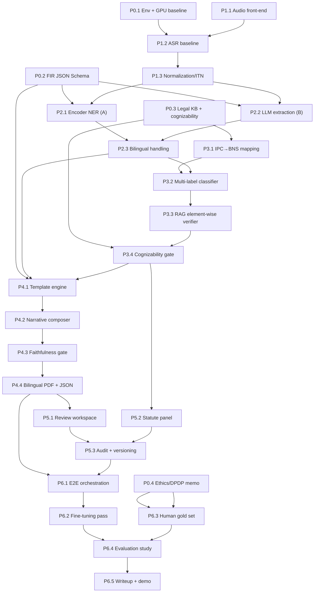

# PLAN.md — Speech-Driven FIR Drafting System (Tamil Nadu IF-1)

> **Status:** Draft for human verification. Decision-support system, not decision automation.
> The officer is always the author of record; the system drafts, never files.

## 0. Guiding principles (non-negotiable design constraints)

1. **Decision support, not automation.** Every automated output is overridable,
   provenance-linked, and audit-logged. Mandatory officer verification before anything leaves the
   system.
2. **Grounded generation only.** No generative model writes into structured IF-1 fields. The LLM
   composes only the narrative, and every generated sentence must trace to transcript spans;
   unsupported content is a hard failure.
3. **Local-only & offline-degradable.** All inference runs on one on-prem box; the core path must
   degrade gracefully when connectivity is lost. No third-party hosted APIs at any stage
   (development or production).
4. **Provenance everywhere.** Every extracted value carries character offsets + audio timestamps +
   confidence. Source Tamil utterances are preserved verbatim and never discarded.
5. **Privacy by design.** PII minimization, DPDP Act 2023 alignment, encryption at rest,
   retention limits, RBAC, immutable audit trail.
6. **Legal-mapping honesty.** IPC-era corpora are mapped to BNS/BNSS via the official MHA tables;
   ambiguous mappings are flagged, never silently resolved.

## 1. Scope

**In:** Tamil / Tamil-English speech → draft bilingual FIR (IF-1) + machine-readable JSON, with
statute suggestions, element-wise justifications, cognizability routing, and an officer-review UI.

**Out (for now):** actual e-filing / CCTNS integration, biometrics, case-progress tracking beyond
FIR registration, languages other than Tamil/English.

## 2. Timeline overview (two semesters ≈ 30 working weeks)

- **Semester 1 (weeks 1–15): Foundations + component MVPs + statute research core.** Ends with a
  thin **end-to-end vertical slice** on synthetic data.
- **Semester 2 (weeks 16–30): Fine-tuning, hardening, evaluation, officer UI, human gold set,
  final study.** Ends with the evaluated, documented capstone system.

Assumed staffing: small team (2–4) or a resourced solo student; the roadmap is expressed as
workstreams that parallelize if staffed and serialize cleanly if solo. Assumed cadence: 2-week
sprints, phase-gate review at each phase boundary.

## 3. Phased roadmap & milestones

Milestone IDs are referenced by the dependency graph in §4. "Exit criteria" are the phase gate.

### Phase P0 — Foundations & de-risking (weeks 1–3)

| ID | Milestone | Key tasks | Exit criteria |
|----|-----------|-----------|---------------|
| P0.1 | Repo, env, GPU baseline | Mono-repo layout, Docker Compose skeleton, pin CUDA/torch, confirm 16 GB budget with a co-residence smoke test (Whisper int8 + 8B 4-bit + embedder loaded together) | All three models load together < 14 GB VRAM; health-check passes |
| P0.2 | Canonical FIR JSON Schema v0 | Encode IF-1 as JSON Schema (see ARCHITECTURE.md); validation lib + fixtures | Schema validates 5 hand-built sample records; round-trips to/from template |
| P0.3 | Legal knowledge base v0 | Ingest BNS/BNSS bare acts (India Code), BNSS First Schedule (cognizability), build IPC→BNS mapping table from MHA correspondence PDFs | Section-level KB queryable; cognizability lookup returns correct class for 20 spot-checked sections |
| P0.4 | Ethics/DPDP & data-governance memo | Data handling policy, consent scripts for future human recordings, PII taxonomy | Reviewed by supervisor; retention + access policy written |

### Phase P1 — Speech ingestion & ASR (weeks 3–7)

| ID | Milestone | Key tasks | Exit criteria |
|----|-----------|-----------|---------------|
| P1.1 | Audio front-end | Capture/upload, resample→16 kHz mono, VAD segmentation, optional diarization (guided-interview mode) | Clean segments emitted with timestamps; diarization separates 2 speakers on test clips |
| P1.2 | ASR baseline (zero-shot) | Wire faster-whisper large-v3 (int8) + AI4Bharat IndicConformer/IndicWhisper; produce transcript + word timestamps | WER/CER measured on FLEURS-ta + Common Voice-ta held-out |
| P1.3 | Post-ASR normalization | Punctuation restoration, ITN (dates, times, phone, vehicle-reg, currency), disfluency/filler removal | ITN unit tests pass; normalized text preserves raw spans + offsets |
| P1.4 | Guided-interview TTS (optional path) | Indic-TTS prompts to elicit missing mandatory IF-1 fields | Prompts triggered by schema-completeness gap; audio playback works |

### Phase P2 — Information extraction / NLU (weeks 6–11, overlaps P1)

| ID | Milestone | Key tasks | Exit criteria |
|----|-----------|-----------|---------------|
| P2.1 | Extraction approach A: encoder NER + rules | Fine-tune MuRIL/XLM-R/IndicBERT token classifier (seed on OpenNyAI legal NER), rule-based slot assembly into IF-1 fields | Slot-level P/R/F1 on synthetic gold; produces valid schema instances |
| P2.2 | Extraction approach B: LLM structured extraction | JSON-Schema-constrained decoding (local 8B) emitting per-field confidence + span provenance (char offsets + audio ts) | Emits schema-valid JSON with provenance for 100% of fields; head-to-head vs A logged |
| P2.3 | Bilingual field handling | Preserve Tamil verbatim, render English equivalents where the form requires, transliteration/translation utilities | ta/en pair populated per bilingual field; no source loss |

### Phase P3 — Statute identification (research core) (weeks 9–16, spans semester boundary)

| ID | Milestone | Key tasks | Exit criteria |
|----|-----------|-----------|---------------|
| P3.1 | IPC→BNS mapping layer | Machine-readable MHA correspondence table; many-to-many + ambiguity flags; versioned | ILSI IPC labels re-expressible as BNS; ambiguous cases surfaced not hidden |
| P3.2 | Multi-label offence classifier | Train on ILSI (IPC) → mapped to BNS; MuRIL/InLegalBERT multi-label head; reproduce LeSICiN-style baseline | Micro/macro-F1 within reach of LeSICiN on ILSI (BNS-mapped); reported honestly |
| P3.3 | RAG element-wise verifier | Retrieve statutory elements per candidate section (BGE-m3/e5 over BNS text); local LLM checks each "ingredient of offence" against complaint → per-section justification | Element-wise justification emitted per candidate; faithfulness measured |
| P3.4 | Cognizability gate | BNSS First Schedule lookup; cognizable → FIR draft, non-cognizable → CSR advisory (TN practice); conservative default = flag to officer | Correct routing on labeled section set; "mixed/undetermined" handled |

### Phase P4 — FIR instantiation (weeks 16–21)

| ID | Milestone | Key tasks | Exit criteria |
|----|-----------|-----------|---------------|
| P4.1 | Deterministic template engine | Fill all structured IF-1 fields from JSON; **no generative model touches structured fields** | Byte-stable output for identical input; schema→form mapping complete |
| P4.2 | Grounded narrative composer | Local LLM writes Tamil + English narrative under constrained decoding; every sentence linked to spans | 100% sentences carry supporting spans; register is formal |
| P4.3 | Faithfulness / entailment gate | NLI or LLM-judge checks each narrative sentence entails from cited spans; hard-fail unsupported claims | Hallucination rate → 0 on gold; unsupported sentences blocked/flagged |
| P4.4 | Print-faithful bilingual PDF | Render TN FIR layout (replicated from public FIR copies) + machine-readable JSON export | PDF visually matches reference layout; JSON validates against schema |

### Phase P5 — Officer verification UI (weeks 18–24, overlaps P4)

| ID | Milestone | Key tasks | Exit criteria |
|----|-----------|-----------|---------------|
| P5.1 | Review workspace | Transcript ↔ extracted fields side-by-side, span-level provenance links, confidence heat-map, inline editing | Officer can click a field → highlights source span + plays audio segment |
| P5.2 | Statute panel | Suggested sections with expandable element-wise justifications; accept/override | Accept/override recorded per section with reason |
| P5.3 | Audit & versioning | Immutable audit log of every accept/override/edit; document versioning; final "verified" state | Full replayable history; diff between versions |

### Phase P6 — Integration, human gold set & evaluation (weeks 22–30)

| ID | Milestone | Key tasks | Exit criteria |
|----|-----------|-----------|---------------|
| P6.1 | End-to-end orchestration | LangGraph pipeline wiring all stages; latency budget enforced; offline-degradable path validated | E2E draft produced within latency budget (§8) on synthetic set |
| P6.2 | Fine-tuning pass | LoRA/QLoRA per §6 on in-domain synthetic + gold data; zero-shot vs fine-tuned comparison | Fine-tuned beats zero-shot on ASR/extraction/statute metrics or reason documented |
| P6.3 | Human gold set + annotation | Self-recorded Tamil complaints → annotate against gold protocol (§5) | Gold set built, double-annotated subset with IAA reported |
| P6.4 | Full evaluation study | Run harness across all metrics (§7); rubric-based human eval; officer edit-distance | Complete results tables + error analysis |
| P6.5 | Capstone writeup & demo | Final report, reproducibility package, demo | Documented, reproducible, defended |

## 4. Milestone dependency graph

**Critical path:** P0.1 → P1.1 → P1.2 → P1.3 → P2.2 → P3.2 → P3.3 → P3.4 → P4.1 → P4.2 → P4.3 →
P4.4 → P6.1 → P6.2 → P6.4 → P6.5. The statute research core (P3.\*) is the longest pole and the
graded contribution — protect its schedule.

## 5. Dataset acquisition & annotation plan

### 5.1 Source datasets (reuse, do not recollect)

| Purpose | Datasets | Notes |
|---------|----------|-------|
| Tamil ASR train/eval | AI4Bharat Kathbath, Shrutilipi, IndicSUPERB; Common Voice-ta; FLEURS-ta; IISc-MILE Tamil | License-check each; Shrutilipi is large/noisy → filter |
| Code-switched ASR | Synthetic code-switch set (our own) + any code-switched slices found | No large public Tamil-English complaint audio exists |
| Statute ID | ILSI (~66K fact descriptions, 100 IPC sections) + LeSICiN codebase | IPC-era → must apply IPC→BNS mapping |
| Legal NER seed | OpenNyAI Indian legal NER corpora | Transfer/warm-start for IF-1 slot NER |
| Statute text (KB/RAG) | BNS 2023, BNSS 2023 bare acts (India Code); special acts (MV Act, IT Act 2000, TN Prohibition of Harassment of Woman Act) | Authoritative element text for the verifier |
| Mapping | Official MHA IPC↔BNS / CrPC↔BNSS correspondence tables | Build versioned machine-readable table |
| Form fidelity | Public TN Police citizen-services FIR copies | Layout replication only |

### 5.2 Synthetic end-to-end data (Phase-1 primary — per locked decision #3)

No public annotated Tamil complaint-audio corpus exists, so we generate our own:

1. **Narrative generation (local LLM):** Qwen2.5-14B-Instruct (4-bit) produces Tamil / code-switched
   colloquial complaint narratives across offence categories, seeded from BNS section templates and
   scenario schemata. **Because cloud is prohibited (decision #2), generation quality is capped by
   the local model** — mitigated with strong templating, category coverage matrices, and human
   curation (see risk R1).
2. **Paired gold labels generated *by construction*:** because we generate from structured scenario
   seeds, we get "free" gold IF-1 field labels + gold section labels for the synthetic set (the seed
   *is* the label), avoiding manual annotation for synthetic data.
3. **Voicing:** AI4Bharat Indic-TTS renders narratives to audio (vary speaker, speed, noise) for the
   ASR + E2E pipeline.
4. **Curation:** human spot-check + grammar/fluency filter; reject implausible or legally incoherent
   scenarios.

Target synthetic volume: **~3,000–5,000 narratives** (structured-seed labeled) for extraction /
statute training+dev; **~300–500 voiced** for ASR/E2E dev.

### 5.3 Human gold set (Phase-2 milestone P6.3 — synthetic-first, human later)

Real evaluation cannot rest on synthetic data alone. Proposed **self-recorded** gold set (per
decision #3):

- **Volunteers** read/improvise realistic Tamil & code-switched complaint scripts (no live PII;
  fictitious particulars). Consent per P0.4 governance memo.
- **Gold-set size proposal (justification):**
  - **Extraction + statute gold: 500 complaints.** Rationale: at ~40 slot-decisions/complaint that is
    ~20k slot judgments — enough for stable slot-level F1 CIs (±~3–4% at 95%) and for macro-F1 on the
    long-tail of sections. A **100-complaint double-annotated subset** measures inter-annotator
    agreement (Cohen's κ / Krippendorff's α) with adjudication.
  - **ASR eval: 5–10 hours held-out Tamil + a dedicated 2–3 hour code-switched subset.** Enough for
    WER/CER with tight CIs across registers/speakers.
  - **End-to-end gold: 100–150 complaints with audio + gold FIR** for field-completeness, officer
    edit-distance, and time-to-draft.
- Numbers are a proposal; scale down first (e.g., 150 extraction / 3 h ASR / 40 E2E) if annotation
  budget is tight, and treat the full set as a stretch goal.

### 5.4 Annotation protocol

1. **Guidelines document** per IF-1 field: definition, examples, Tamil-span preservation rules,
   date/time/interval conventions, known/unknown-accused rules, property-valuation rules, delay-reason
   handling, section-labeling rubric ("ingredients of offence" checklist per candidate section).
2. **Tooling:** span-level annotation (e.g., Label Studio / Doccano) capturing char offsets + audio
   timestamps; schema-validated output.
3. **Two-pass + adjudication:** double-annotate the IAA subset; adjudicate disagreements; freeze a
   gold version (DVC-tracked).
4. **Legal review:** a law-qualified reviewer validates section labels + cognizability on a sample.
5. **Versioning:** every gold release is immutable + versioned; metrics always cite the gold version.

## 6. Fine-tuning strategy (PEFT-first, 16 GB budget)

General policy: **compare zero-shot vs fine-tuned** for every trainable stage; prefer LoRA/QLoRA;
quantized inference (NF4 / int8 / GPTQ-AWQ). Track every run in offline MLflow; data via DVC.

| Stage | Base model(s) | Method | Data | Sketch of hyperparams | Compute (16 GB) |
|-------|---------------|--------|------|------------------------|-----------------|
| ASR | Whisper large-v3; IndicWhisper (medium); IndicConformer | LoRA on attention proj (Whisper); optional full FT of IndicConformer | Kathbath/Shrutilipi/IndicSUPERB-ta + synthetic code-switch | r=32, α=32, lr≈1e-3, 2–3 epochs, bf16, grad-accum | Fits; large-v3 LoRA ≈ 10–12 GB |
| Extraction NER (A) | MuRIL / XLM-R-base / IndicBERT v2 | Full fine-tune (small) | OpenNyAI seed + synthetic IF-1 spans | lr 2e-5, 3–5 epochs, wd 0.01 | Trivial (<4 GB) |
| Extraction LLM (B) | Local 8B (Qwen2.5-7B / Llama-3.1-8B) | QLoRA (NF4) + JSON-schema constrained decoding at inference | Synthetic (transcript→IF-1 JSON w/ provenance) | r=16–32, α=32, lr 2e-4, 2–3 epochs, NF4 double-quant | QLoRA 8B ≈ 10–12 GB |
| Statute classifier | InLegalBERT / MuRIL (multi-label head) | Full fine-tune | ILSI (BNS-mapped) | lr 2e-5, 4 epochs, BCE, class-balanced | Trivial |
| Statute verifier LLM | Local 8B (resident) | Few-shot + RAG first; QLoRA on element-wise verification traces if needed | Synthetic element-checks (distilled from Qwen-14B local teacher) | r=16, α=32, lr 2e-4 | Shares resident 8B |
| Narrative composer | Local 8B | QLoRA on (fields+spans→formal narrative ta/en); constrained decoding | Synthetic paired | r=16–32, α=32, lr 2e-4 | Shares resident 8B |
| Faithfulness gate | XLM-R/IndicBERT NLI or LLM-judge | Fine-tune NLI head or few-shot judge | Synthetic entailment pairs | lr 2e-5 | Trivial |

**Note (decision #1, 16 GB):** QLoRA training caps at ~8–9B. A 13B/14B can be used at 4-bit
*inference* (≈9–10 GB) but not co-resident with ASR — so the 14B is reserved for **offline batch**
synthetic-data generation, not the latency path. Inference path keeps one resident 4-bit 8B via a
local server (Ollama/llama.cpp/vLLM) + int8 ASR + embedder.

## 7. Evaluation-harness plan

A single config-driven, reproducible harness (`harness/`): dataset version (DVC) + model version +
config → metrics artifact, logged to offline MLflow. A small fixed fixture set runs in CI (pytest)
as a golden regression on every change.

| Stage | Metrics | Tooling |
|-------|---------|---------|
| ASR | WER, CER on held-out Tamil + code-switched sets (report per register/speaker) | jiwer |
| Extraction | Slot-level precision / recall / F1 vs gold; schema-validity rate; provenance-coverage rate | seqeval + custom slot scorer |
| Statute ID | Micro/macro-F1 (+ LRAP) vs LeSICiN baseline on ILSI (BNS-mapped); cognizability routing accuracy | scikit-learn |
| Justification faithfulness | Element-support rate; NLI entailment rate; hallucinated-element rate | NLI model + custom |
| Narrative faithfulness | Span-support rate (target 100%), unsupported-sentence rate (hard-fail=0), chrF/BLEU vs reference | custom + sacrebleu |
| End-to-end | Field-completeness rate; officer edit-distance on structured fields (normalized tree/edit distance) + on narrative; time-to-draft; rubric-based human eval | custom + human panel |

Baselines: zero-shot every stage; LeSICiN on ILSI for statute ID; report fine-tuned deltas with CIs.

## 8. Latency budget (assumed: 3-minute spoken complaint; target ≤ ~4 min to review-ready draft)

| Stage | Budget | Basis |
|-------|--------|-------|
| A. ASR (faster-whisper large-v3 int8) | 45 s | ~4–8× real-time on 16 GB GPU for a 3-min clip |
| A′. Normalization / ITN / punctuation | 10 s | CPU-light |
| B. Extraction (constrained 8B, 1–few calls) | 30 s | ~1–2k-token transcript |
| C. Statute ID (classifier + RAG + element verify, batched) | 90 s | Heaviest; multiple short LLM calls, batched |
| D. Narrative compose + faithfulness gate | 40 s | 1 gen + 1 entailment pass |
| D′. PDF + JSON render | 5 s | Deterministic |
| **Total** | **≈ 3.7 min** | Resident 8B server avoids model-swap overhead |

Degraded 12 GB fallback: swap ASR to IndicConformer + serialize model loads; expect +30–60 s.

## 9. Risk register

| ID | Risk | Likelihood | Impact | Mitigation |
|----|------|-----------|--------|------------|
| R1 | **Local-only caps synthetic-data quality** (no frontier teacher) | High | High | Largest local model that fits (Qwen2.5-14B 4-bit, offline batch); strong scenario templates + coverage matrix; human curation; grammar/fluency filter; treat synthetic as bootstrap, validate on human gold |
| R2 | No public Tamil complaint-audio corpus | Certain | Med | Synthetic-first (decision #3) + self-recorded human gold set later (P6.3) |
| R3 | IPC→BNS mapping is many-to-many / ambiguous | High | High | Build from official MHA tables; version it; flag ambiguous mappings for human review; never auto-resolve silently |
| R4 | Narrative hallucination | Med | Critical | Constrained decoding + entailment gate + hard-fail on unsupported spans + mandatory officer review; span-support metric gates release |
| R5 | Code-switching degrades ASR | High | Med | Code-switched synthetic FT set; ITN; surface low-confidence tokens to officer |
| R6 | 16 GB VRAM contention | Med | Med | Resident 4-bit 8B server + int8 ASR co-residence; 14B only offline; documented 12 GB fallback |
| R7 | Legal-correctness liability | Med | Critical | Decision-support framing; mandatory officer verification; visible disclaimers; full audit trail; law-qualified review of gold labels |
| R8 | Cognizability misrouting (FIR vs CSR) | Med | High | BNSS First Schedule as authoritative table; conservative default = flag to officer; "mixed/undetermined" state |
| R9 | PII / DPDP non-compliance | Med | High | PII minimization; local encrypted storage; retention limits; RBAC; audit; fictitious data for gold set |
| R10 | Domain shift (ILSI legalese vs colloquial speech) | High | Med | In-domain synthetic + human gold adaptation; report cross-domain metrics honestly |
| R11 | Annotation inconsistency | Med | Med | Guidelines + double-annotation + IAA + adjudication + legal review |
| R12 | TN form / statute updates (schema drift) | Low | Med | Externalized templates + versioned schema + versioned KB |
| R13 | Two-semester scope creep | High | High | Strict phase gates; thin E2E vertical slice by end of Sem 1; MVP-before-polish |

## 10. Definition of done (capstone)

- Thin E2E slice by end of Semester 1 (synthetic).
- All five stages implemented, orchestrated, offline-degradable, within latency budget.
- Both extraction approaches (A vs B) evaluated head-to-head.
- Statute research core with element-wise justifications + faithfulness metrics + LeSICiN comparison.
- Officer UI with provenance links, confidence heat-map, accept/override, audit + versioning.
- Human gold set built + full evaluation study + error analysis + reproducibility package.
